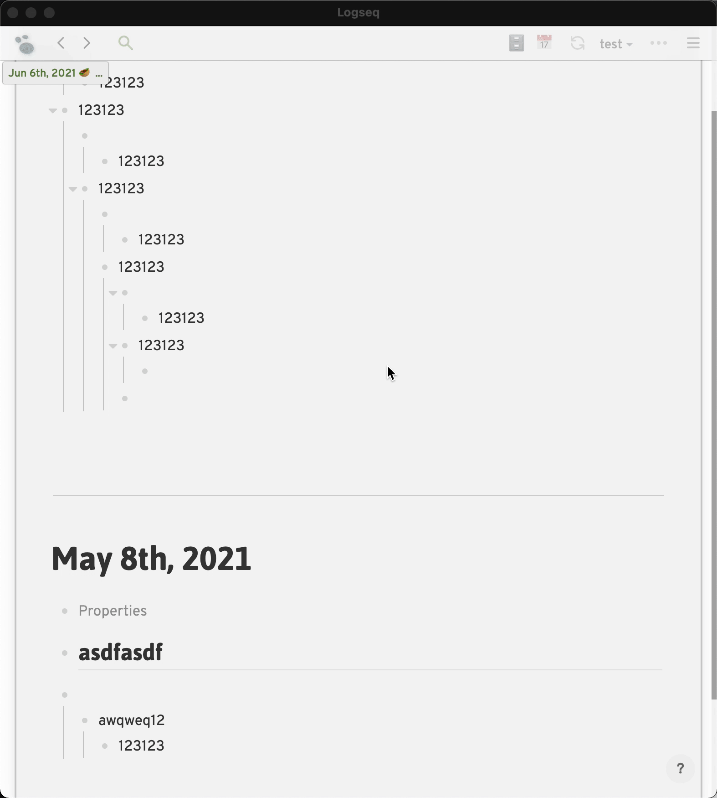
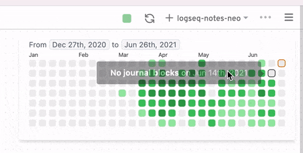

# Logseq Heatmap Plugin

This plugin will render a GitHub/Flomo style heatmap based on how many journal
blocks created that day.

Once Logseq provides an option to denote all blocks with timestamps, we may
be able to calculate a more accurate block numbers.

## How to use?

Firstly, turn on Logseq developer mode

### Option 1: directly install via Marketplace

### Option 2: manually load

- [download the prebuilt package here](https://github.com/pengx17/logseq-plugin-heatmap/releases)
- unzip the zip file and load from Logseq plugins page

## Demo

